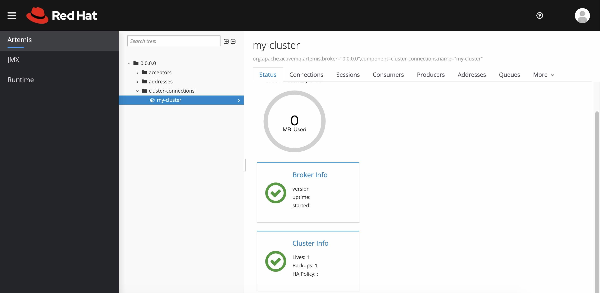
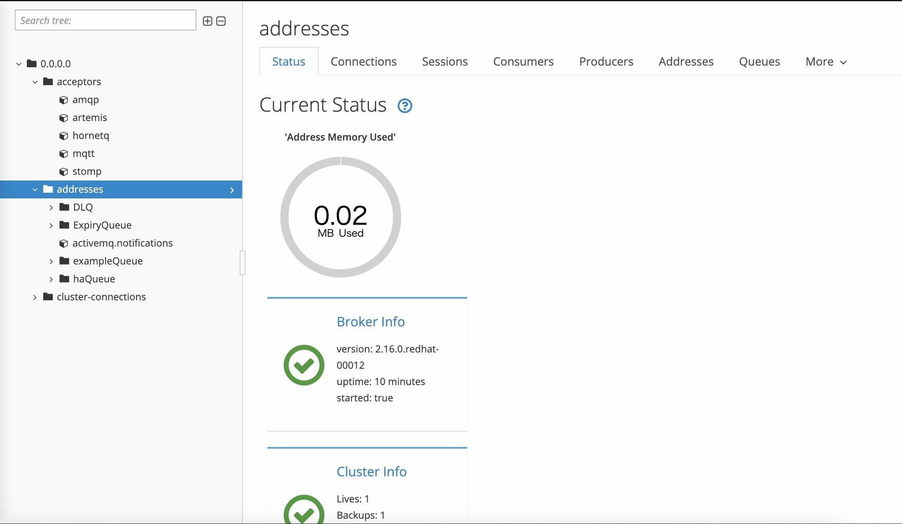
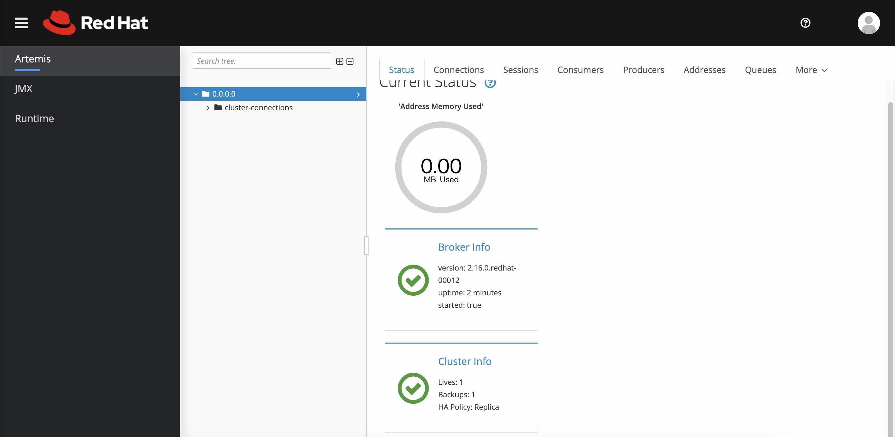
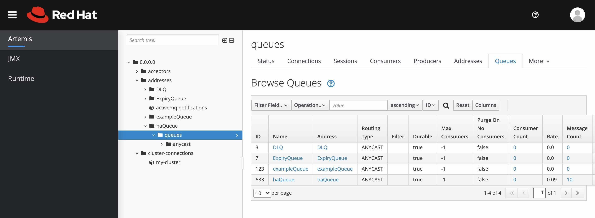

# AMQ Broker HA Replicatate 2VM

## Prerequirement

* 2VM
  * prepare 2VM RHEL 8.x
  * ex. Azure VM

* AMQ Broker 7.8.1
  * Download AMQ Broker installer at Red Hat Portal site.
  * amq-broker-7.8.1-bin.zip

* Open JDK 11
  * not use openjdk11 zip installer. use yum command.

## 1. Install OpenJDK 11

install openjdk11 both VMs.

```bash
$ sudo yum install java-11-openjdk-devel

$ java -version
openjdk version "11.0.10" 2021-01-19 LTS
OpenJDK Runtime Environment 18.9 (build 11.0.10+9-LTS)
OpenJDK 64-Bit Server VM 18.9 (build 11.0.10+9-LTS, mixed mode, sharing)

# sudo su -
Last login: Fri Apr 16 05:01:01 UTC 2021 on pts/0

# java -version
openjdk version "11.0.10" 2021-01-19 LTS
OpenJDK Runtime Environment 18.9 (build 11.0.10+9-LTS)
OpenJDK 64-Bit Server VM 18.9 (build 11.0.10+9-LTS, mixed mode, sharing)

# exit
```

## 2. Upload AMQ Broker Install file

upload AMQ Broker Install file on to current user directory.

ex. /home/\<USER>\>/amq-broker-7.8.1-bin.zip


## 3. Install Procedure

execute following commands both VMs.

```
$ sudo useradd amq-broker
$ sudo passwd amq-broker
Changing password for user amq-broker.
New password: 
Retype new password: 
passwd: all authentication tokens updated successfully.

$ sudo mkdir /opt/redhat
$ sudo mkdir /opt/redhat/amq-broker
$ sudo chown -R amq-broker:amq-broker /opt/redhat/amq-broker

$ sudo chown amq-broker:amq-broker amq-broker-7.8.1-bin.zip
$ sudo mv amq-broker-7.8.1-bin.zip /opt/redhat/amq-broker

$ su - amq-broker
$ cd /opt/redhat/amq-broker
$ unzip amq-broker-7.8.1-bin.zip

$ /opt/redhat/amq-broker/amq-broker-7.8.1/bin/artemis create broker
Creating ActiveMQ Artemis instance at: /opt/redhat/amq-broker/amq-broker-7.8.1/broker

--user: is a mandatory property!
Please provide the default username:
admin

--password: is mandatory with this configuration:
Please provide the default password:

--allow-anonymous | --require-login: is a mandatory property!
Allow anonymous access?, valid values are Y,N,True,False
Y

Auto tuning journal ...
done! Your system can make 0.62 writes per millisecond, your journal-buffer-timeout will be 1624000

You can now start the broker by executing:  

   "/opt/redhat/amq-broker/amq-broker-7.8.1/broker/bin/artemis" run

Or you can run the broker in the background using:

   "/opt/redhat/amq-broker/amq-broker-7.8.1/broker/bin/artemis-service" start
```

## 4. Registrer Linux Service

execute following commands both VMs.

```
$ sudo touch /etc/systemd/system/amq-broker.service
$ sudo vi /etc/systemd/system/amq-broker.service
$ sudo cat /etc/systemd/system/amq-broker.service
[Unit]
Description=AMQ Broker
After=syslog.target network.target

[Service]
ExecStart=/opt/redhat/amq-broker/amq-broker-7.8.1/broker/bin/artemis run
Restart=on-failure
User=amq-broker
Group=amq-broker

# A workaround for Java signal handling
SuccessExitStatus=143

[Install]
WantedBy=multi-user.target

$ sudo systemctl enable amq-broker
Created symlink /etc/systemd/system/multi-user.target.wants/amq-broker.service → /etc/systemd/system/amq-broker.service.

$ sudo systemctl start amq-broker

$ sudo systemctl status amq-broker
● amq-broker.service - AMQ Broker
   Loaded: loaded (/etc/systemd/system/amq-broker.service; disabled; vendor preset: disabled)
   Active: active (running) since Sat 2021-04-17 01:02:28 UTC; 23s ago
 Main PID: 6184 (java)
    Tasks: 44 (limit: 11073)
   Memory: 230.6M
   CGroup: /system.slice/amq-broker.service
           └─6184 java -XX:+PrintClassHistogram -XX:+UseG1GC -Xms512M -Xmx2G -Dhawtio.disableProxy=true -Dhawtio.realm=>

Apr 17 01:02:39 AMQ01 artemis[6184]: SLF4J: Found binding in [jar:file:/opt/redhat/amq-broker/amq-broker-7.8.1/lib/slf4>
Apr 17 01:02:39 AMQ01 artemis[6184]: SLF4J: See http://www.slf4j.org/codes.html#multiple_bindings for an explanation.
Apr 17 01:02:39 AMQ01 artemis[6184]: SLF4J: Actual binding is of type [org.slf4j.impl.Log4jLoggerFactory]
Apr 17 01:02:39 AMQ01 artemis[6184]: INFO  | main | Initialising hawtio services
Apr 17 01:02:39 AMQ01 artemis[6184]: INFO  | main | Configuration will be discovered via system properties
Apr 17 01:02:39 AMQ01 artemis[6184]: INFO  | main | Welcome to hawtio 2.0.0.fuse-sb2-780022-redhat-00001
Apr 17 01:02:39 AMQ01 artemis[6184]: INFO  | main | Starting hawtio authentication filter, JAAS realm: "activemq" autho>
Apr 17 01:02:39 AMQ01 artemis[6184]: INFO  | main | Proxy servlet is disabled
Apr 17 01:02:39 AMQ01 artemis[6184]: INFO  | main | Jolokia overridden property: [key=policyLocation, value=file:/opt/r>
Apr 17 01:02:39 AMQ01 artemis[6184]: 2021-04-17 01:02:39,522 INFO  [org.apache.activemq.artemis] AMQ241001: HTTP Server>

Break[Cntrl + C]
```

## 5. Linux OS Configure

add lines into limits.conf both VMs.

```bash
$ sudo vi /etc/security/limits.conf
$ sudo cat /etc/security/limits.conf 
...

amq-broker   soft  nofile  20000
amq-broker   hard  nofile  20000

...
```

## 6. Change Firewall Settings

execute following commands both VMs.

```bash
$ sudo firewall-cmd --add-port=8161/tcp --zone=public --permanent
$ sudo firewall-cmd --add-port=5672/tcp --zone=public --permanent
$ sudo firewall-cmd --add-port=61616/tcp --zone=public --permanent
$ sudo firewall-cmd --add-port=61613/tcp --zone=public --permanent
$ sudo firewall-cmd --add-port=5445/tcp --zone=public --permanent
$ sudo firewall-cmd --add-port=1883/tcp --zone=public --permanent

$ sudo firewall-cmd --reload
$ sudo firewall-cmd --list-all
public (active)
  target: default
  icmp-block-inversion: no
  interfaces: eth0
  sources: 
  services: cockpit dhcpv6-client ssh
  ports: 8161/tcp 5672/tcp 61616/tcp 61613/tcp 5445/tcp 1883/tcp
  protocols: 
  masquerade: no
  forward-ports: 
  source-ports: 
  icmp-blocks: 
  rich rules: 
```

## 7. Enable Remote Access WEB Console

edit bootstrap.xml and jolokia-access.xml both VMs.

bootstrap.xml

```bash
   <web bind="http://0.0.0.0:8161" path="web"> <!-- 127.0.0.1 to 0.0.0.0 -->
       <app url="redhat-branding" war="redhat-branding.war"/>
       <app url="artemis-plugin" war="artemis-plugin.war"/>
       <app url="console" war="hawtio.war"/>
       <app url="metrics" war="metrics.war"/>
   </web>
```

jolokia-access.xml

```bash
    <cors>
        <allow-origin>*://*</allow-origin> <!-- Changed -->
        <!-- Options from this point on are auto-generated by Create.java from the Artemis CLI -->
        <!-- Check for the proper origin on the server side, too -->
        <strict-checking/>
    </cors>
```

and Azure Network Security Group add Accept 8186 port on Azure Portal.


This settings use non-production environment.

## 6. AMQ Broker HA Configure

edit broker.xml each VMs.

AMQ01[Private IP : 10.0.0.4]

broker.xml

```bash

...
      <connectors>
         <!-- Connector used to be announced through cluster connections and notifications -->
         <connector name="artemis">tcp://10.0.0.4:61616</connector>
         <connector name="discovery-connector">tcp://10.0.0.5:61616</connector>
      </connectors>

      <cluster-user>clusterUser</cluster-user>
      <cluster-password>clusterPassword</cluster-password>
      <cluster-connections>
         <cluster-connection name="my-cluster">
            <connector-ref>artemis</connector-ref>
            <message-load-balancing>ON_DEMAND</message-load-balancing>
            <max-hops>1</max-hops>
            <static-connectors>
               <connector-ref>discovery-connector</connector-ref>
            </static-connectors>
         </cluster-connection>
      </cluster-connections>

      <ha-policy>
         <replication>
            <master>
               <vote-on-replication-failure>true</vote-on-replication-failure>
            </master>
         </replication>
      </ha-policy>
...

```

AMQ02[Private IP : 10.0.0.5]

broker.xml
```bash

...
      <connectors>
         <!-- Connector used to be announced through cluster connections and notifications -->
         <connector name="artemis">tcp://10.0.0.5:61616</connector>
         <connector name="discovery-connector">tcp://10.0.0.4:61616</connector>
      </connectors>

      <cluster-user>clusterUser</cluster-user>
      <cluster-password>clusterPassword</cluster-password>
      <cluster-connections>
         <cluster-connection name="my-cluster">
            <connector-ref>artemis</connector-ref>
            <message-load-balancing>ON_DEMAND</message-load-balancing>
            <max-hops>1</max-hops>
            <static-connectors>
               <connector-ref>discovery-connector</connector-ref>
            </static-connectors>
         </cluster-connection>
      </cluster-connections>

      <ha-policy>
         <replication>
            <slave>
               <allow-failback>true</allow-failback>
            </slave>
         </replication>
      </ha-policy>
...

```

## 8. Restart Broker Instances

execute following commands both VMs.

```bash
$ sudo systemctl stop amq-broker
$ sudo systemctl start amq-broker
```

## 8. WEB Console

AMQ01 WEB Console URL

http://[AMQ01 VM Global IP]:8161/

AMQ02 WEB Console URL

http://[AMQ02 VM Global IP]:8161/

login username and password is admin:password.


### 8.1 Access AMQ01 WEB Console

after login, AMQ01 WEB Console refer all elements.





### 8.2 Access AMQ02 WEB Console

after login, AMQ02 WEB Console does not refer acceptor and address.



on Started, AMQ02 Slave Broker does't listen most part of port. view only cluster connection.

```bash
$ netstat -an | grep 8161
tcp6       0      0 :::8161                 :::*                    LISTEN     
$ netstat -an | grep 5672
$ netstat -an | grep 61616
tcp6       0      0 10.0.0.5:52162          10.0.0.4:61616          ESTABLISHED
$ netstat -an | grep 61613
$ netstat -an | grep 5445
$ netstat -an | grep 1883 
```

## 7. Testing

Testing doesn't use Linux Service Command. Use artemise command directly.

## 7.1 Start AMQ01 AMQ Broker Instance

AMQ01 AMQ Broker is Master Broker.

Start AMQ01 Broker Service.

```bash
$ sudo systemctl stop amq-broker
$ su - amq-broker
$ /opt/redhat/amq-broker/amq-broker-7.8.1/broker/bin/artemis run
```

## 7.2 Start AMQ01 AMQ Broker Instance

AMQ02 AMQ Broker is Slave Broker.

Start AMQ01 Broker Service.

```bash
$ sudo systemctl stop amq-broker
$ su - amq-broker
$ /opt/redhat/amq-broker/amq-broker-7.8.1/broker/bin/artemis run
```

After AMQ02 Broker Started, output following message.

```bash
2021-04-20 11:13:42,685 INFO  [org.apache.activemq.artemis.core.server] AMQ221025: Replication: sending NIOSequentialFile /opt/redhat/amq-broker/amq-broker-7.8.1/broker/data/journal/activemq-data-2.amq (size=10,485,760) to replica.
2021-04-20 11:13:42,947 INFO  [org.apache.activemq.artemis.core.server] AMQ221025: Replication: sending NIOSequentialFile /opt/redhat/amq-broker/amq-broker-7.8.1/broker/data/bindings/activemq-bindings-7.bindings (size=1,048,576) to replica.
2021-04-20 11:13:42,957 INFO  [org.apache.activemq.artemis.core.server] AMQ221025: Replication: sending NIOSequentialFile /opt/redhat/amq-broker/amq-broker-7.8.1/broker/data/bindings/activemq-bindings-2.bindings (size=1,048,576) to replica.
```

## 7.3 Send Message to AMQ01 AMQ Broker Instance

execute following command on amq-broker user on AMQ01 VM.

```bash
$ /opt/redhat/amq-broker/amq-broker-7.8.1/broker/bin/artemis producer --message-count 10 --url "tcp://10.0.0.4:61616" --destination queue://haQueue
Connection brokerURL = tcp://10.0.0.4:61616
Producer ActiveMQQueue[haQueue], thread=0 Started to calculate elapsed time ...

Producer ActiveMQQueue[haQueue], thread=0 Produced: 10 messages
Producer ActiveMQQueue[haQueue], thread=0 Elapsed time in second : 0 s
Producer ActiveMQQueue[haQueue], thread=0 Elapsed time in milli second : 357 milli seconds
```

## 7.4 Stop AMQ Master Broker

Execute break[Ctrl + CAMQ01] artemis run prompt.

After Master Broker Stopped, Slave Broker output follwing message.

```bash
2021-04-20 04:28:05,887 INFO  [org.apache.activemq.artemis.core.server] AMQ221007: Server is now live
2021-04-20 04:28:05,911 INFO  [org.apache.activemq.artemis.core.server] AMQ221020: Started EPOLL Acceptor at 10.0.0.5:61616 for protocols [CORE,MQTT,AMQP,STOMP,HORNETQ,OPENWIRE]
2021-04-20 04:28:05,920 INFO  [org.apache.activemq.artemis.core.server] AMQ221020: Started EPOLL Acceptor at 10.0.0.5:5445 for protocols [HORNETQ,STOMP]
2021-04-20 04:28:05,921 INFO  [org.apache.activemq.artemis.core.server] AMQ221020: Started EPOLL Acceptor at 10.0.0.5:5672 for protocols [AMQP]
2021-04-20 04:28:05,925 INFO  [org.apache.activemq.artemis.core.server] AMQ221020: Started EPOLL Acceptor at 10.0.0.5:1883 for protocols [MQTT]
2021-04-20 04:28:05,926 INFO  [org.apache.activemq.artemis.core.server] AMQ221020: Started EPOLL Acceptor at 10.0.0.5:61613 for protocols [STOMP]
```

Also, Switch Slave Broker to Master Broker. AMQ02 AMQ Broker Listen 61616, 5672, 61613, 5445, 1883 ports.

```bash
$ netstat -an | grep 61616
tcp6       0      0 10.0.0.5:61616          :::*                    LISTEN     
tcp6       0      0 10.0.0.5:61616          10.0.0.5:51602          ESTABLISHED
tcp6       0      0 10.0.0.5:51602          10.0.0.5:61616          ESTABLISHED
$ netstat -an | grep 5672
tcp6       0      0 10.0.0.5:5672           :::*                    LISTEN     
$ netstat -an | grep 61613
tcp6       0      0 10.0.0.5:61613          :::*                    LISTEN     
$ netstat -an | grep 5445
tcp6       0      0 10.0.0.5:5445           :::*                    LISTEN     
$ netstat -an | grep 1883
tcp6       0      0 10.0.0.5:1883           :::*                    LISTEN     
```

AMQ02 WEB Console, you will be able to refer accepter, addresses, recieve message count.



## 7.5 Recieve Message at AMQ02 AMQ Broker Instance

execute following command on amq-broker user on AMQ02 VM.

```bash
$ /opt/redhat/amq-broker/amq-broker-7.8.1/broker/bin/artemis consumer --message-count 10 --url "tcp://10.0.0.5:61616" --destination queue://haQueue
Consumer ActiveMQQueue[haQueue], thread=0 wait until 10 messages are consumed
Consumer ActiveMQQueue[haQueue], thread=0 Consumed: 10 messages
Consumer ActiveMQQueue[haQueue], thread=0 Elapsed time in second : 0 s
Consumer ActiveMQQueue[haQueue], thread=0 Elapsed time in milli second : 24 milli seconds
Consumer ActiveMQQueue[haQueue], thread=0 Consumed: 10 messages
Consumer ActiveMQQueue[haQueue], thread=0 Consumer thread finished
```

## 7.6 Fail Back Master Broker Instance

execute following command on amq-broker user on AMQ01 VM.

```bash
$ /opt/redhat/amq-broker/amq-broker-7.8.1/broker/bin/artemis run
```

## 8. Reference

https://access.redhat.com/documentation/ja-jp/openjdk/11/html/installing_and_using_openjdk_11_on_rhel/installing-openjdk11-on-rhel8

https://access.redhat.com/documentation/en-us/red_hat_amq/2020.q4/html/getting_started_with_amq_broker/installing-broker-getting-started

https://activemq.apache.org/components/artemis/documentation/latest/perf-tuning.html

